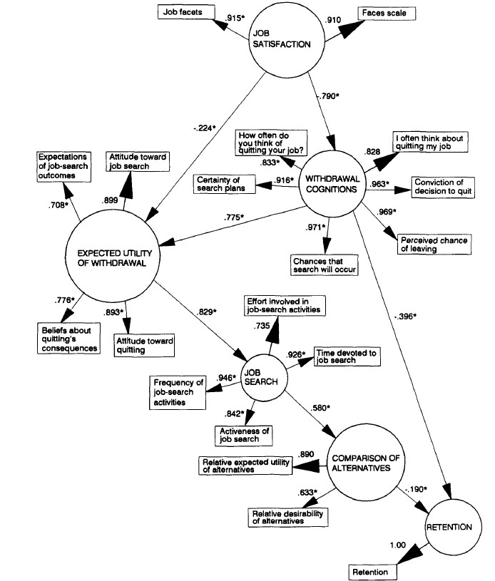
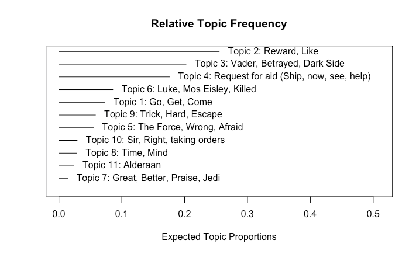
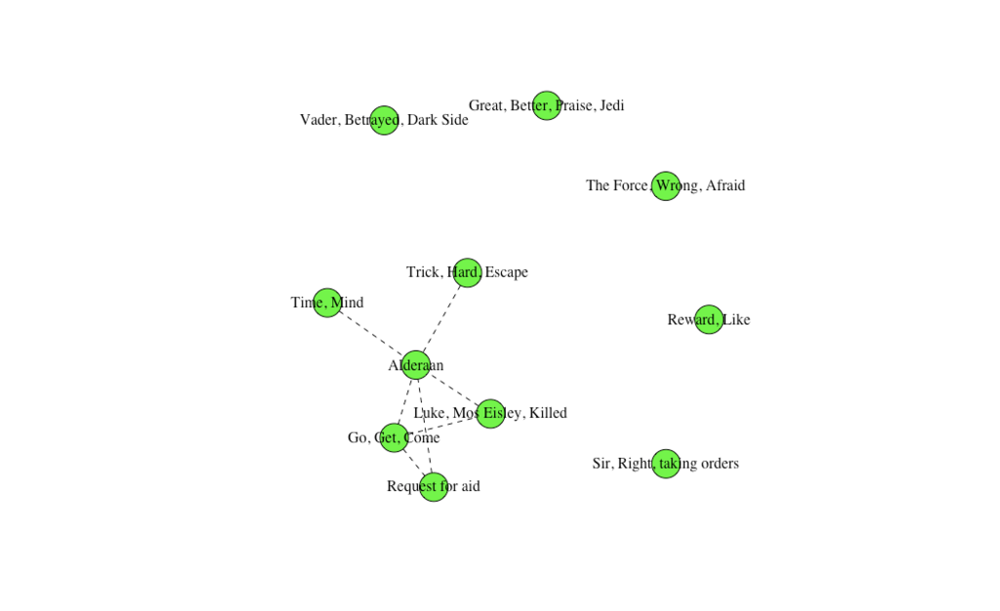
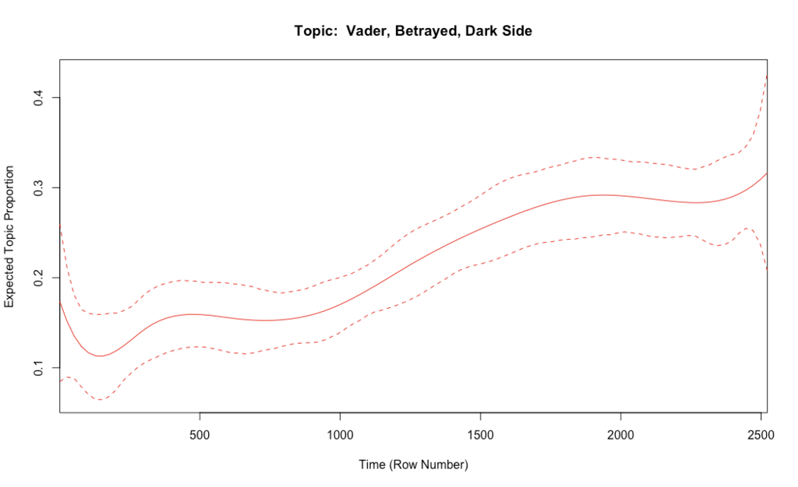

```{r setup, include = FALSE}

library(revealjs)

knitr::opts_chunk$set(warning = FALSE)

```

<style type="text/css">
  .reveal p {
    text-align: left;
    color: #FFFFFF
  }
  .reveal ul {
    display: block;
  }
  .reveal ol {
    display: block;
  }
  
  body {
  margin: 0;
  background-color: black;
}

.star {
  position: absolute;
  width: 1px;
  height: 1px;
  background-color: white;
}
</style>

<script>
// Sets the number of stars we wish to display
const numStars = 100;

// For every star we want to display
for (let i = 0; i < numStars; i++) {
  let star = document.createElement("div");  
  star.className = "star";
  var xy = getRandomPosition();
  star.style.top = xy[0] + 'px';
  star.style.left = xy[1] + 'px';
  document.body.append(star);
}

// Gets random x, y values based on the size of the container
function getRandomPosition() {  
  var y = window.innerWidth;
  var x = window.innerHeight;
  var randomX = Math.floor(Math.random()*x);
  var randomY = Math.floor(Math.random()*y);
  return [randomX,randomY];
}
</script>

You can follow this session at http://rpubs.com/keithmcnulty/hr_meetup_london.

All code is available on [Github](https://github.com/keithmcnulty/hr_meetup_london).


## The story so far

<center>
<a href="https://s3.us-east-2.amazonaws.com/drkeithmcnulty.com/intro.html" target="_blank">Check it out (with sound)!</a>
</center>


# Who I am and why I'm here {data-background-image="r2d2-threepio.png" data-background-size="300px" data-background-position="left top"}

## About me {data-background-image="r2d2-threepio.png" data-background-size="300px" data-background-position="left top"}

* Mathematician and Psychometrician/I-O Psychologist
* Passionate about data science and open source tech
* Day job: People Measurement and Analytics at McKinsey & Company (Globally)
* Blogs: [LinkedIn](https://www.linkedin.com/in/keith-mcnulty/), [Medium](https://medium.com/@keith.mcnulty)
* Twitter: [dr_keithmcnulty](https://twitter.com/dr_keithmcnulty)

## What I will talk about today {data-background-image="r2d2-threepio.png" data-background-size="300px" data-background-position="left top"}

Together with my Advanced Analytics team, I experiment with the more advanced methodologies in the field of People Analytics. 

I'll share some examples of these today:

1.  Structural Equation Modelling
2.  Structural Topic Modelling
3.  Network analytics
4.  Survival analysis

# Structural Equation Modelling (SEM) {data-background-image="hanchewy.png" data-background-size="300px" data-background-position="left top"}

##  What is SEM? {data-background-image="hanchewy.png" data-background-size="300px" data-background-position="left top"}

*TL;DR*: It simplifies very complicated modelling situations.

* A statistical technique used for causal modelling.  
* Suitable for situations where there are many variables.
* Identifies a smaller number of latent variables and quantifies their effect on each other and on outcomes of interest.

##  Example of SEM (an old one)^[Hom, P. W. & Griffeth, R. W. (1991). Structural equations modeling test of a turnover theory: Cross-sectional and longitudinal analyses. Journal of Applied Psychology. 76, 350-366] {data-background-image="hanchewy.png" data-background-size="300px" data-background-position="left top"}


``` {r fig.align = "center", out.width = "50%", dpi = 48, echo = FALSE}



```

##  Common practical uses of SEM {data-background-image="hanchewy.png" data-background-size="300px" data-background-position="left top"}


1. Surveys:  

* Particularly company surveys which have become organically larger and more complex over time.
* Can simplify large number of survey items into a small number of latent factors and relate them to overall satisfaction or other outcomes.
* For example:  Meaningfulness of work, Work-Life Balance, Citizenship and Belonging 
* Makes it much easier to explain and communicate what drives overall satisfaction and retention

2. Other explanatory modelling (eg Promotion, Retention, Recruiting outcomes)

# Structural Topic Modelling (STM) {data-background-image="stormtrooper.png" data-background-size="300px" data-background-position="left top"}

## What is STM? {data-background-image="stormtrooper.png" data-background-size="300px" data-background-position="left top"}

*TL;DR*: Analyze large amounts of text data to understand what people are talking about.

* Topic Modelling is a statistical technique for identifying the topics in large corpuses of text data using *Latent Dirichlet Allocation*.  
* *Structural* Topic Modelling is a more advanced approach often allowing detection of topics in smaller corpuses and also allowing covariate analysis.
* Examples:  What matters more to women than men? How do junior staff speak about leadership versus senior staff?

## What topics characterize the original Star Wars trilogy? {data-background-image="stormtrooper.png" data-background-size="300px" data-background-position="left top"}

``` {r fig.align = "center", out.width = "70%", dpi = 48, echo = FALSE}



```

## A suprising amount of dialogue centres around Alderaan {data-background-image="stormtrooper.png" data-background-size="300px" data-background-position="left top"}

``` {r fig.align = "center", out.width = "70%", dpi = 48, echo = FALSE}



```

## Luke talks about the Dark Side differently to Yoda {data-background-image="stormtrooper.png" data-background-size="300px" data-background-position="left top"}

``` {r fig.align = "center", out.width = "70%", dpi = 48, echo = FALSE}

knitr::include_graphics("darkside-luke-yoda.png")

```


## The entire trilogy builds around the Dark Side narrative {data-background-image="stormtrooper.png" data-background-size="300px" data-background-position="left top"}

``` {r fig.align = "center", out.width = "70%", dpi = 48, echo = FALSE}



```


##  Common practical uses of STM {data-background-image="stormtrooper.png" data-background-size="300px" data-background-position="left top"}

1.  Surveys (again!):  Analyzing open text responses across many hundreds and thousands of people.
2.  Blogs and Media:  eg how are people talking about Brexit in France?
3.  Mining text data in organizations:  eg notes from exit interviews to identify retention factors, performance review text to identify common strengths and training needs.


# Network Analysis {data-background-image="deathstar.png" data-background-size="300px" data-background-position="left top"}

##  What is Network Analysis {data-background-image="deathstar.png" data-background-size="300px" data-background-position="left top"}

*TL;DR*:  Better understanding connectedness within an organization

* Finding ways to identify if people are connected 
* Mapping connections diagramatically
* Understanding importance of individuals in networks

## Example network visualization {data-background-image="deathstar.png" data-background-size="300px" data-background-position="left top"}

* Click [here](http://rpubs.com/keithmcnulty/sampleforcenetwork) to view
* Uses a force directed algorithm to plot the network
* Node size is the *betweenness centrality* of the individual - bigger nodes are more important in connecting others

## Survival Analysis: linking connectedness and retention {data-background-image="deathstar.png" data-background-size="300px" data-background-position="left top"}


``` {r fig.align = "center", out.width = "70%", dpi = 48, echo = FALSE}

knitr::include_graphics("network-survival.jpg")

```


## Common practical uses of Network analysis {data-background-image="stormtrooper.png" data-background-size="300px" data-background-position="left top"}

1.  Retention:  Understanding poor connectedness/lack of network in organizations, understanding how a departure might impact others.
2.  Leadership:  Finding ideal candidates for leadership positions based on their existing connections.
3.  Influencing:  Finding the right people to spread a message in the organization.

# Using R Shiny to make these tools more widely accessible {data-background-image="millenium.png" data-background-size="300px" data-background-position="left top"}

## What is R Shiny? {data-background-image="millenium.png" data-background-size="300px" data-background-position="left top"}

*TL;DR*:  Makes data science methods available to non-data scientists

*  Wraps R code in a user interface.
*  Allows non-data scientists to interact with a method by means of a website.
*  Incredibly powerful way of democratizing advanced methods.
*  Often only requires a few extra lines of code on top of what the data scientist has already written.

## Simple example R Shiny app {data-background-image="millenium.png" data-background-size="300px" data-background-position="left top"}

* Generates a force directed network visualization and calculates node centrality based on an uploaded set of connections.

* Upload a simple from/to list of connections and instantly generates network viz

* Try it out [here](https://keith-mcnulty.shinyapps.io/fd_network_generator/), and find the code on [Github](https://github.com/keithmcnulty/hr_meetup_london/blob/master/fd_network_generator.Rmd).

# May the force be with you! {data-background-image="darth.png" data-background-size="300px" data-background-position="left top"}
